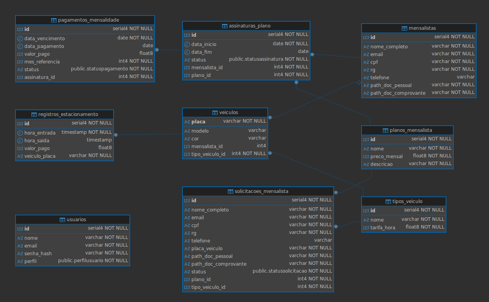

# Banco de Dados - MedPark

Esta página contém a documentação do Banco de Dados.

## Tecnologias

- Sistema Gerenciador de Banco de Dados (SGBD): PostgreSQL
- Mapeamento Objeto-Relacional (ORM): SQLAlchemy
- Ferramenta de Gerenciamento Visual: DBeaver

## DDL

O script SQL a seguir foi gerado a partir de uma função do DBeaver.

```sql
-- public.mensalistas definition

-- Drop table

-- DROP TABLE public.mensalistas;

CREATE TABLE public.mensalistas (
	id serial4 NOT NULL,
	nome_completo varchar NOT NULL,
	email varchar NOT NULL,
	cpf varchar NOT NULL,
	rg varchar NOT NULL,
	telefone varchar NULL,
	path_doc_pessoal varchar NOT NULL,
	path_doc_comprovante varchar NOT NULL,
	CONSTRAINT mensalistas_cpf_key UNIQUE (cpf),
	CONSTRAINT mensalistas_pkey PRIMARY KEY (id)
);
CREATE UNIQUE INDEX ix_mensalistas_email ON public.mensalistas USING btree (email);
CREATE INDEX ix_mensalistas_id ON public.mensalistas USING btree (id);


-- public.planos_mensalista definition

-- Drop table

-- DROP TABLE public.planos_mensalista;

CREATE TABLE public.planos_mensalista (
	id serial4 NOT NULL,
	nome varchar NOT NULL,
	preco_mensal float8 NOT NULL,
	descricao varchar NOT NULL,
	CONSTRAINT planos_mensalista_pkey PRIMARY KEY (id)
);
CREATE INDEX ix_planos_mensalista_id ON public.planos_mensalista USING btree (id);
CREATE UNIQUE INDEX ix_planos_mensalista_nome ON public.planos_mensalista USING btree (nome);


-- public.tipos_veiculo definition

-- Drop table

-- DROP TABLE public.tipos_veiculo;

CREATE TABLE public.tipos_veiculo (
	id serial4 NOT NULL,
	nome varchar NOT NULL,
	tarifa_hora float8 NOT NULL,
	CONSTRAINT tipos_veiculo_pkey PRIMARY KEY (id)
);
CREATE INDEX ix_tipos_veiculo_id ON public.tipos_veiculo USING btree (id);
CREATE UNIQUE INDEX ix_tipos_veiculo_nome ON public.tipos_veiculo USING btree (nome);


-- public.usuarios definition

-- Drop table

-- DROP TABLE public.usuarios;

CREATE TABLE public.usuarios (
	id serial4 NOT NULL,
	nome varchar NOT NULL,
	email varchar NOT NULL,
	senha_hash varchar NOT NULL,
	perfil public."perfilusuario" NOT NULL,
	CONSTRAINT usuarios_pkey PRIMARY KEY (id)
);
CREATE UNIQUE INDEX ix_usuarios_email ON public.usuarios USING btree (email);
CREATE INDEX ix_usuarios_id ON public.usuarios USING btree (id);
CREATE INDEX ix_usuarios_nome ON public.usuarios USING btree (nome);


-- public.assinaturas_plano definition

-- Drop table

-- DROP TABLE public.assinaturas_plano;

CREATE TABLE public.assinaturas_plano (
	id serial4 NOT NULL,
	data_inicio date NOT NULL,
	data_fim date NULL,
	status public."statusassinatura" NOT NULL,
	mensalista_id int4 NOT NULL,
	plano_id int4 NOT NULL,
	CONSTRAINT assinaturas_plano_pkey PRIMARY KEY (id),
	CONSTRAINT assinaturas_plano_mensalista_id_fkey FOREIGN KEY (mensalista_id) REFERENCES public.mensalistas(id),
	CONSTRAINT assinaturas_plano_plano_id_fkey FOREIGN KEY (plano_id) REFERENCES public.planos_mensalista(id)
);
CREATE INDEX ix_assinaturas_plano_id ON public.assinaturas_plano USING btree (id);


-- public.pagamentos_mensalidade definition

-- Drop table

-- DROP TABLE public.pagamentos_mensalidade;

CREATE TABLE public.pagamentos_mensalidade (
	id serial4 NOT NULL,
	data_vencimento date NOT NULL,
	data_pagamento date NULL,
	valor_pago float8 NULL,
	mes_referencia int4 NOT NULL,
	status public."statuspagamento" NOT NULL,
	assinatura_id int4 NOT NULL,
	CONSTRAINT pagamentos_mensalidade_pkey PRIMARY KEY (id),
	CONSTRAINT pagamentos_mensalidade_assinatura_id_fkey FOREIGN KEY (assinatura_id) REFERENCES public.assinaturas_plano(id)
);
CREATE INDEX ix_pagamentos_mensalidade_id ON public.pagamentos_mensalidade USING btree (id);


-- public.solicitacoes_mensalista definition

-- Drop table

-- DROP TABLE public.solicitacoes_mensalista;

CREATE TABLE public.solicitacoes_mensalista (
	id serial4 NOT NULL,
	nome_completo varchar NOT NULL,
	email varchar NOT NULL,
	cpf varchar NOT NULL,
	rg varchar NOT NULL,
	telefone varchar NULL,
	placa_veiculo varchar NOT NULL,
	path_doc_pessoal varchar NOT NULL,
	path_doc_comprovante varchar NOT NULL,
	status public."statussolicitacao" NOT NULL,
	plano_id int4 NOT NULL,
	tipo_veiculo_id int4 NOT NULL,
	CONSTRAINT solicitacoes_mensalista_pkey PRIMARY KEY (id),
	CONSTRAINT solicitacoes_mensalista_plano_id_fkey FOREIGN KEY (plano_id) REFERENCES public.planos_mensalista(id),
	CONSTRAINT solicitacoes_mensalista_tipo_veiculo_id_fkey FOREIGN KEY (tipo_veiculo_id) REFERENCES public.tipos_veiculo(id)
);
CREATE INDEX ix_solicitacoes_mensalista_id ON public.solicitacoes_mensalista USING btree (id);


-- public.veiculos definition

-- Drop table

-- DROP TABLE public.veiculos;

CREATE TABLE public.veiculos (
	placa varchar NOT NULL,
	modelo varchar NULL,
	cor varchar NULL,
	mensalista_id int4 NULL,
	tipo_veiculo_id int4 NOT NULL,
	CONSTRAINT veiculos_pkey PRIMARY KEY (placa),
	CONSTRAINT veiculos_mensalista_id_fkey FOREIGN KEY (mensalista_id) REFERENCES public.mensalistas(id),
	CONSTRAINT veiculos_tipo_veiculo_id_fkey FOREIGN KEY (tipo_veiculo_id) REFERENCES public.tipos_veiculo(id)
);
CREATE INDEX ix_veiculos_placa ON public.veiculos USING btree (placa);


-- public.registros_estacionamento definition

-- Drop table

-- DROP TABLE public.registros_estacionamento;

CREATE TABLE public.registros_estacionamento (
	id serial4 NOT NULL,
	hora_entrada timestamp NOT NULL,
	hora_saida timestamp NULL,
	valor_pago float8 NULL,
	veiculo_placa varchar NOT NULL,
	CONSTRAINT registros_estacionamento_pkey PRIMARY KEY (id),
	CONSTRAINT registros_estacionamento_veiculo_placa_fkey FOREIGN KEY (veiculo_placa) REFERENCES public.veiculos(placa)
);
CREATE INDEX ix_registros_estacionamento_id ON public.registros_estacionamento USING btree (id);

```

## Modelo Físico

O modelo físico a seguir foi gerado a partir de uma função do DBeaver.



<p class="caption">Imagem 1: modelo físico do banco de dados.</p>


## Histórico de Versões

<div align="center">
  <table class="md-table">
    <thead>
      <tr>
        <th align="left">Versão</th>
        <th align="left">Data</th>
        <th align="left">Autor(es)</th>
        <th align="left">Descrição das Alterações</th>
      </tr>
    </thead>
    <tbody>
      <tr>
        <td align="left">1.0</td>
        <td align="left">29/10/2025</td>
        <td align="left">Brunna Louise</td>
        <td align="left">Criação do documento.</td>
      </tr>
    </tbody>
  </table>
</div>

<p class="caption">Tabela 1: Histórico de versões do documento de Banco de Dados do projeto MedPark.</p>