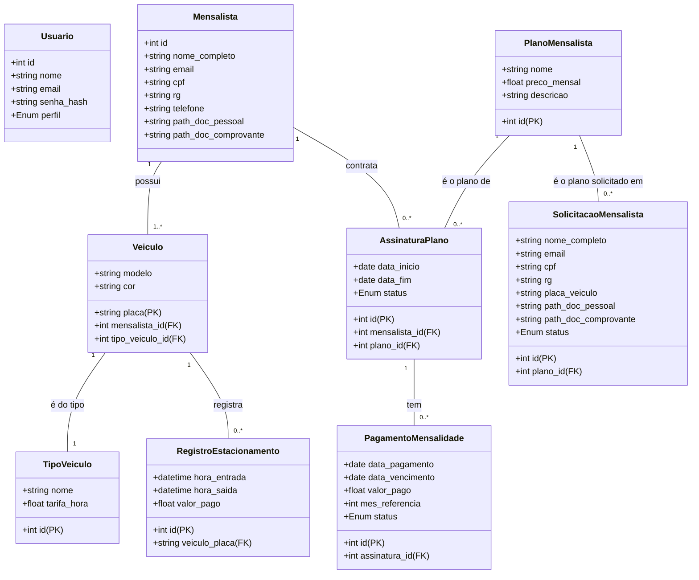

# Diagramas UML

## Diagrama de Classes

Diagrama 1: Diagrama de Classes.

## Histórico de Versões

  <table class="md-table">
    <thead>
      <tr>
        <th align="left">Versão</th>
        <th align="left">Data</th>
        <th align="left">Autor(es)</th>
        <th align="left">Descrição das Alterações</th>
      </tr>
    </thead>
    <tbody>
      <tr>
        <td align="left">1.0</td>
        <td align="left">07/09/2025</td>
        <td align="left">Brunna Louise</td>
        <td align="left">Criação do documento e inserção do Diagrama de Classes.</td>
      </tr>
    </tbody>
  </table>

Tabela 1: Histórico de versões do documento de escopo do projeto MedPark.
