# Protótipo

## Paleta de Cores proposta

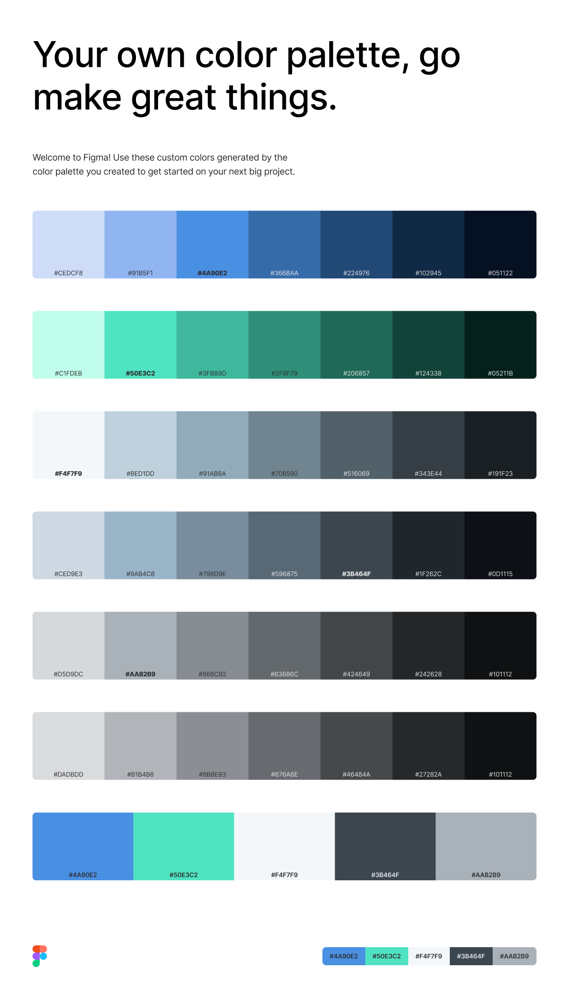

## Protótipo

### Home

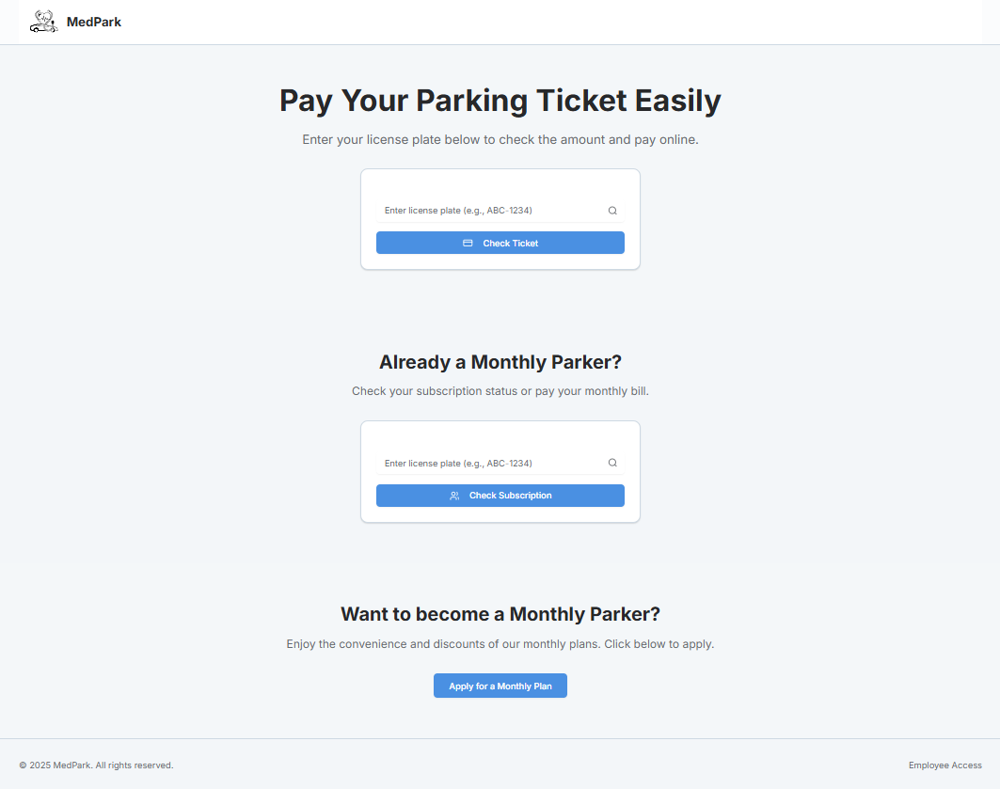

#### Modal de Login

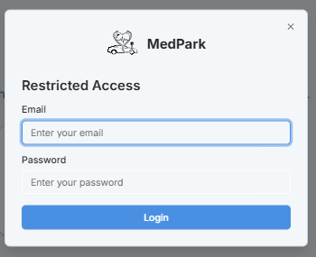

#### Cliente Avulso e Mnesalista - Self-checkout

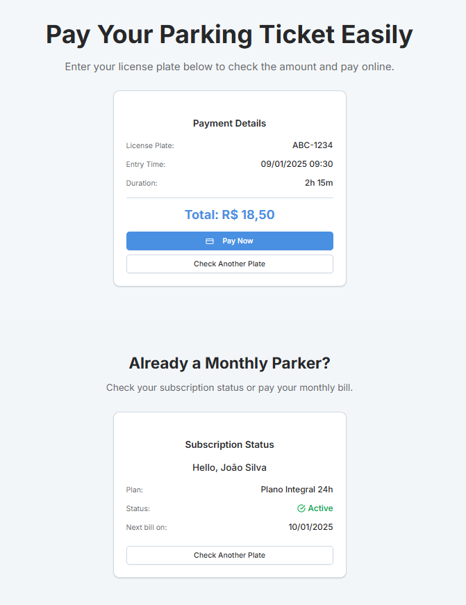

#### Modal de Pagamento

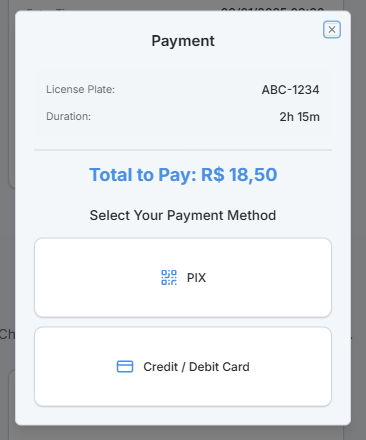

#### Modal de Pagamento - Pix

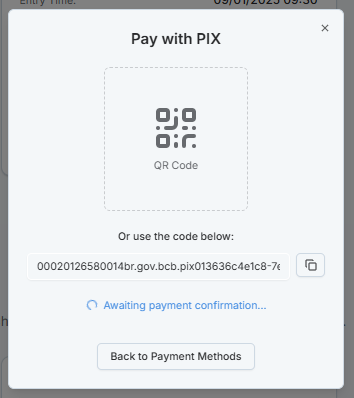

#### Modal de Pagamento - Cartão

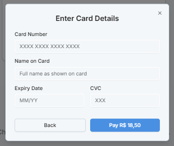

#### Modal de Pagamento - Sucesso

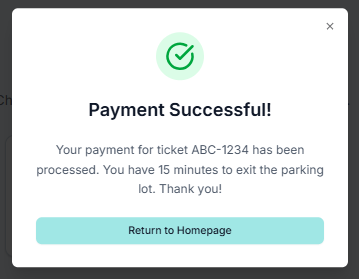

### Dashboard

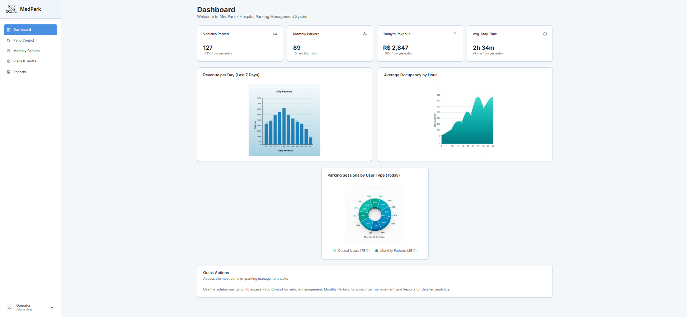

### Controle do Estacionamento

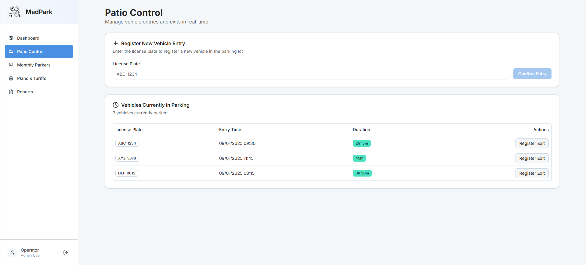

#### Modal de Registro de Saída (com auxílio do operador)

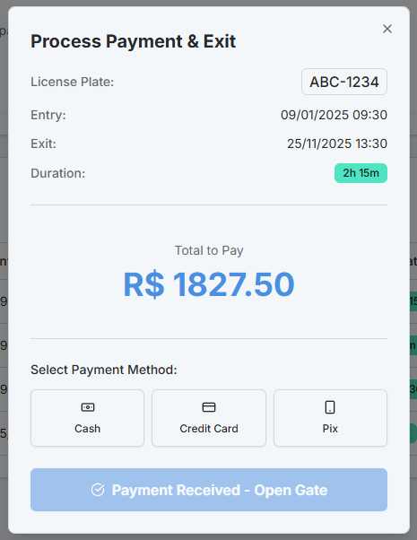

### Mensalistas

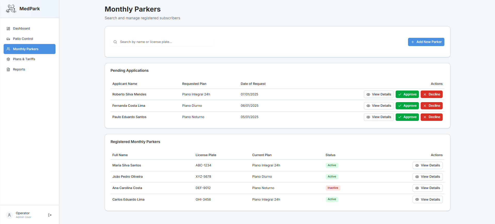

#### Modal de Detalhes da Solicitação de Mensalista

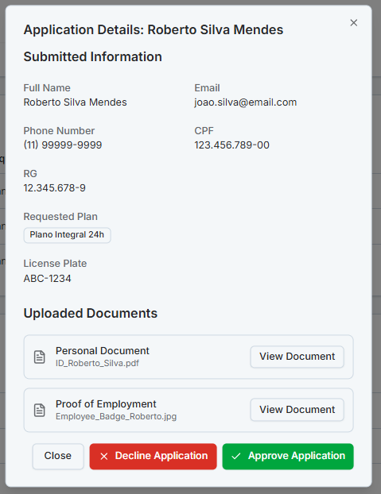

#### Modal de Detalhes do Mensalista

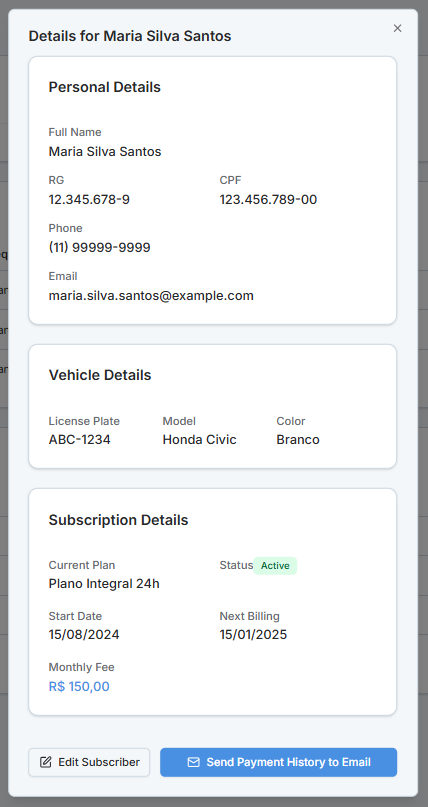

#### Editar Mensalista

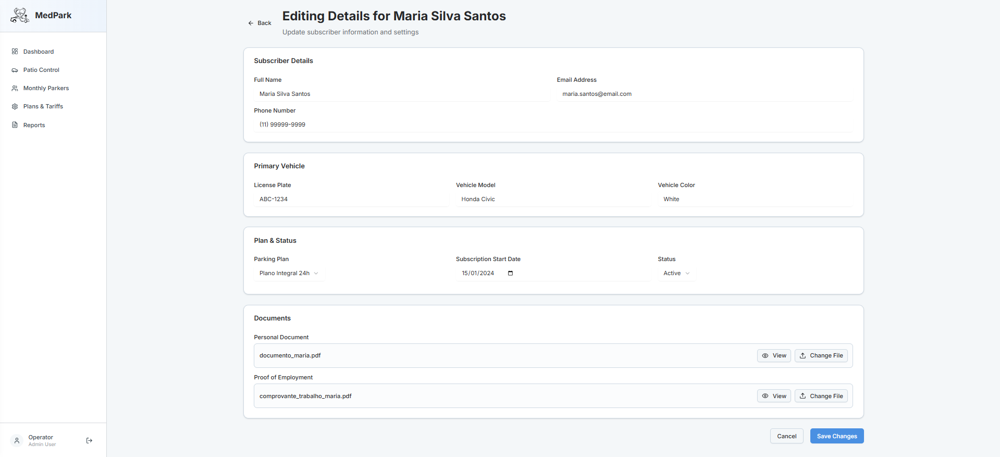

#### Adicionar Novo Mensalista

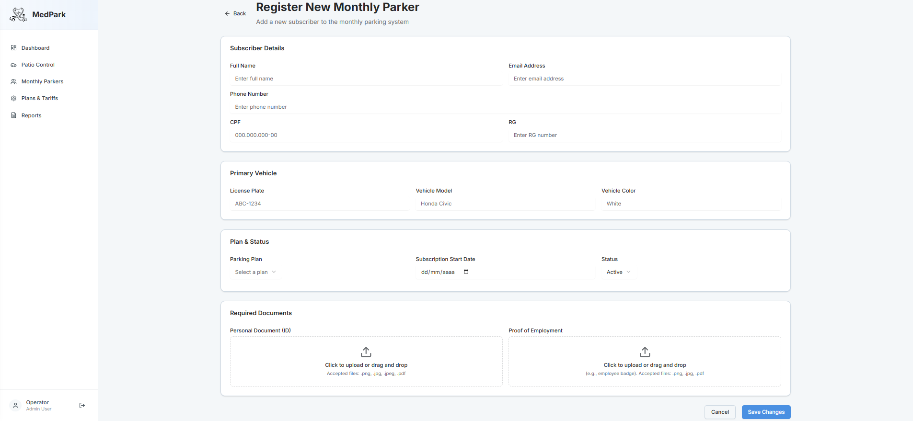

### Planos e Tarifas

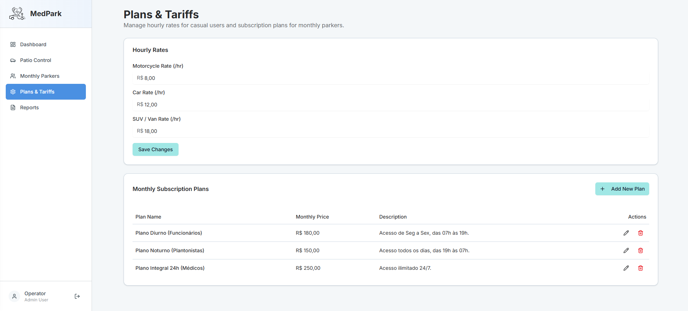

#### Modal de Adicionar Novo Plano

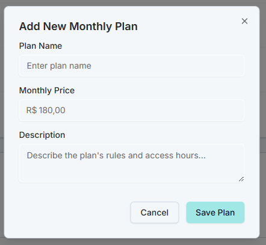

### Relatórios

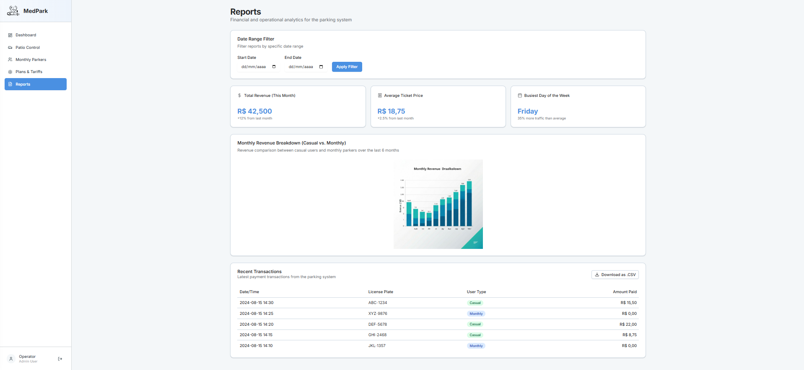

### Protótipo Funcional

Para acessar o protótipo funcional, [clique aqui.](https://v0.app/chat/med-park-parking-system-iVUSaIfYoIf)

## Histórico de Versões

  <table class="md-table">
    <thead>
      <tr>
        <th align="left">Versão</th>
        <th align="left">Data</th>
        <th align="left">Autor(es)</th>
        <th align="left">Descrição das Alterações</th>
      </tr>
    </thead>
    <tbody>
      <tr>
        <td align="left">1.0</td>
        <td align="left">28/09/2025</td>
        <td align="left">Brunna Louise</td>
        <td align="left">Criação do documento.</td>
      </tr>
      <tr>
        <td align="left">1.1</td>
        <td align="left">25/11/2025</td>
        <td align="left">Brunna Louise</td>
        <td align="left">Adiciona telas do protótipo.</td>
      </tr>
    </tbody>
  </table>

Tabela 1: Histórico de versões do documento de protótipo.

